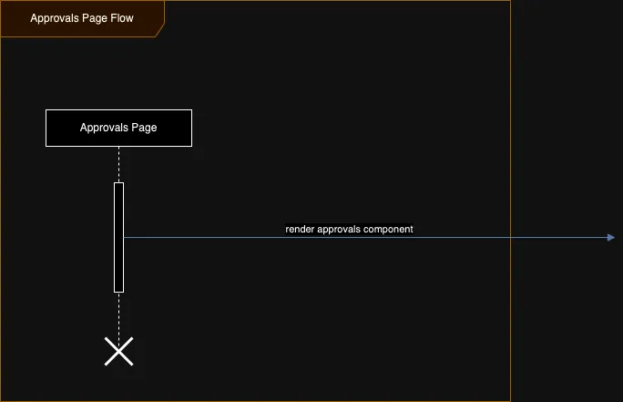

# Approval Page

- Frontend Url :- http://localhost:5173/approvals
- page :- src/pages/Approvals.tsx
- component :- Approvals

!> There is no api call on this page for the data. Only the components are called and the api will be calling in that component respectively.

## Flow Diagram
       